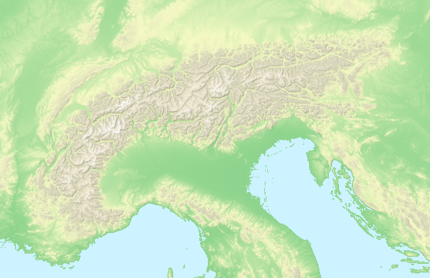

# Demeton

Demeton is a command line tool and an F# library for generating raster hillshading from [NASA's SRTM](https://en.wikipedia.org/wiki/Shuttle_Radar_Topography_Mission) digital elevation model.

Here's an example of Demeton coloring and hillshading of Alps:

You can find a higher-resolution version of the above image [here](docs/images/Alps-elecolor-igor-big.png).

## Downloads

The tool runs on both Windows and Linux. You can find the latest binaries on the [Releases](https://github.com/breki/demeton/releases/latest) page. 

### Which package to use?
- If you are on **Linux**, use **`Demeton-linux-x64-full.zip`** package. It contains Demeton's libraries as well as .NET Core stuff needed to run it.
- If you are on **Windows** and you don't have .NET Core 3 installed, please use the **`Demeton-win10-x64-full.zip`** package, as it includes .NET Core libraries.
- If you are on **Windows** and you already have .NET Core 3 installed, you can use the smaller **`Demeton-win10-x64.zip`** package.

## How to use

Check out this [10-minutes tutorial](docs/Tutorial.md) for a quick introduction to the shader tool.

## More documentation
- [Roadmap](docs/Roadmap.md)
- [Building the code](docs/Building.md)
- [Architecture and source code](docs/Architecture.md)
