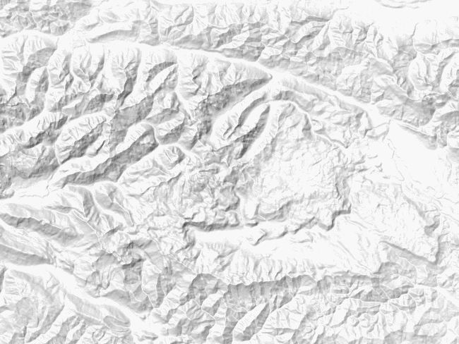
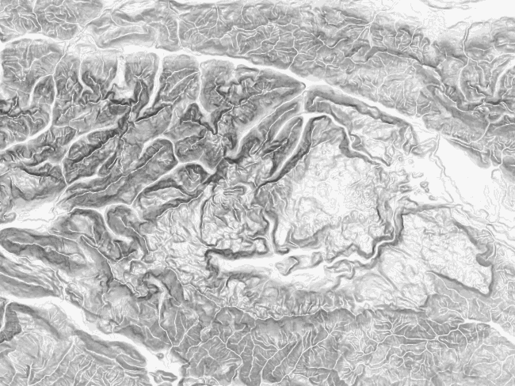
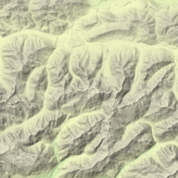
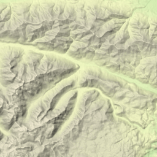
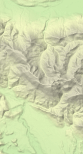

# Demeton - 10 Minutes Tutorial

This tutorial is a short walk-through of some of the capabilities of Demeton's command line. Don't worry, it is not that complex, as you will see.

## Getting the tool
First of all, download the [latest release](https://github.com/breki/demeton/releases/latest). There are several packages available in the release:
- If you are on **Linux**, use **`Demeton-linux-x64-full.zip`** package. It contains Demeton's libraries as well as .NET Core stuff needed to run it.
- If you are on **Windows** and you don't have .NET Core 3 installed, please use the **`Demeton-win10-x64-full.zip`** package, as it includes .NET Core libraries.
- If you are on **Windows** and you already have .NET Core 3 installed, you can use the smaller **`Demeton-win10-x64.zip`** package.

After you have downloaded the package, unzip it to your local disk and open a command line terminal to that directory.

## Getting the test data
In order to generate hillshadings, we need a digital elevation model (DEM) that we can work on. Demeton's GitHub repository has some sample DEM tiles that we will use in this tutorial. 

If you are on Linux, simply run `download-sample-data.sh` script in the command line terminal. It will download two DEM tiles to a subdirectory path `cache/0`.

On Windows, you will have to do this manually, unfortunately. Follow these steps:
1. In the directory where you unzipped Demeton package, create a subdirectory called `cache` and then inside of it, create a subdirectory called `0` (zero).
1. Go to https://github.com/breki/demeton/blob/master/samples/cache/0/N46E013.png with your browser and click on the `Download` button. Copy the downloaded file to the newly created subdirectory path (`cache/0`).
1. Repeat the same for https://github.com/breki/demeton/blob/master/samples/cache/0/N46E014.png

## Our first hillshading

Type in the following command (on Windows, replace `./Demeton.Console` with just `Demeton.Console`):

```sh
./Demeton.Console shade 13.49437,46.159668,14.236633,46.543914 --map-scale 1500000
```

If everything goes well, the command should write out something like:
```txt
2019-11-24 17:55:33Z | NOTE: The command will generate a total raster size of 650x488 pixels (1x1 tiles).
2019-11-24 17:55:33Z | Generating a shade tile 0/0...
2019-11-24 17:55:33Z | Loading PNG SRTM tile 'cache/0/N46E013.png'...
2019-11-24 17:55:33Z | Merging all the read tiles into a single array...
2019-11-24 17:55:34Z | Creating the higher-level tile by downsampling...
2019-11-24 17:55:36Z | Writing SRTM tile l1e06n24...
2019-11-24 17:55:37Z | Loading PNG SRTM tile 'cache/0/N46E014.png'...
2019-11-24 17:55:38Z | Merging all the read tiles into a single array...
2019-11-24 17:55:38Z | Creating the higher-level tile by downsampling...
2019-11-24 17:55:41Z | Writing SRTM tile l1e07n24...
2019-11-24 17:55:42Z | Running elevation coloring step...
2019-11-24 17:55:42Z | Running igor hillshading step...
2019-11-24 17:55:43Z | Running compositing step 'over'...
2019-11-24 17:55:43Z | Saving the shade tile...
2019-11-24 17:55:43Z | Saved a shade tile to output/shading-0-0.png
```

As it said at the end, there is a PNG file waiting for us in the `output` directory:


The image shows elevation colored and hillshaded area of [Triglav national park](https://www.tnp.si/en/visit/) in Slovenia:
- "**Elevation colored**" because terrain elevations are mapped into their respective color, from green (lowlands) to grayish (mountains). As we will see later, we can change this color scheme.
- "**Hillshaded**" because mountain sides opposite the Sun are additionally colored using gray gradients. The direction (or [azimuth](https://en.wikipedia.org/wiki/Azimuth), to be more precise) of the Sun in this case is the standard cartographic one - the Sun shines from northwest.

The coordinates we entered (`13.49437,46.159668,14.236633,46.543914`) represent two pairs of longitudes and latitudes of a bounding box that covers the mentioned national park.

## Map scale
Perhaps you noticed that one of the parameters in the command we used was map scale: `--map-scale 1500000`. So the generated map has a map scale of 1 : 1,500,000 - roughly, since this depends on what kind of device you are reading this tutorial (or maybe you reading it on a paper).

Anyway, the image is small(-ish), but you can make it bigger by specifying a larger map scale:
```sh
./Demeton.Console shade 13.49437,46.159668,14.236633,46.543914 --map-scale 1000000
```

In the tutorial, we'll stick to the original size, though, to save some page space.

## Shading scripts
Let's say we don't want the elevation coloring and are only interested in hillshading. We can tell that to Demeton by defining a **shading script**:

```sh
./Demeton.Console shade 13.49437,46.159668,14.236633,46.543914 --map-scale 1500000 --shading-script igor
```



In this case, the script is very short: `igor` specifies the shading operation to perform. We can specify some parameters to that operation:

```sh
./Demeton.Console shade 13.49437,46.159668,14.236633,46.543914 --map-scale 1500000 --shading-script "igor(sunaz=135,shadcol=#ffff80)"
```

Here we told Demeton the Sun comes from southeast (`sunaz=135` representing Sun azimuth of 135°) and it leaves yellow shades (`shadcol=#ffff80` means the yellowish shading color). Let's call this "sunshading". I know, it's weird, but wait for the next step and it will be clearer:

```sh
./Demeton.Console shade 13.49437,46.159668,14.236633,46.543914 --map-scale 1500000 --shading-script "igor(sunaz=135,shadcol=#ffff80)|+igor"
```

And here's the result:


What magic did we do here? The shading script `igor(sunaz=135,shadcol=#ffff80)|+igor` tells Demeton to perform two operations: first the "sunshading" and then hillshading we did at the start, and merge them together. `|+` is a symbol for this merge.

## Coloring it differently
Now let's switch back to elevation coloring, but with something completely different:
```sh
./Demeton.Console shade 13.49437,46.159668,14.236633,46.543914 --map-scale 1500000 --shading-script "elecolor(scale=0:#000000;3000:#ffffff;none:#00000000)|+igor"
```


We got this odd yet somehow beautiful shading by progressively coloring from black to white as the elevation rises (with added hillshading to give it some plasticity).

Let's explain the shading script we used here:
```
elecolor(scale=0:#000000;3000:#ffffff;none:#00000000)|+igor
```
The first operation is elevation coloring (`elecolor`) with a defined color scale of black for elevation of zero meters (`0:#000000`) and white for elevation of 3000 meters (`3000:#ffffff`). Everything inbetween is a shade of gray, proportional to the elevation.

The second operation is `igor` hillshading, again, which is then merged with the results of elevation coloring.

## Old-style
One more operation we will take a look at is coloring slopes:
```sh
./Demeton.Console shade 13.49437,46.159668,14.236633,46.543914 --map-scale 1500000 --shading-script "slope"
```
`slope` operation colors slopes by their steepness (the steeper the slope, the darker it is), regardless of their orientation to the Sun, which resembles old-style topographic maps:



## Breaking into tiles
One thing to note is that, depending on the size of the geographic area and the map scale, Demeton can produce images of very big pixel dimensions. In order to avoid the final images being too big to handle, Demeton splits the resulting image into **tiles** of 1000x1000 pixels. You can control this using the `tile-size` command line parameter, like this:
```sh
./Demeton.Console shade 13.49437,46.159668,14.236633,46.543914 --tile-size 256 --map-scale 1500000
```
Here we told Demeton to produce tiles of 256x256 pixels size, so we end up with six image files, named `shading-0-0.png`,`shading-0-1.png`,`shading-1-0.png`,`shading-1-1.png`,`shading-2-0.png` and `shading-2-1.png`. Here is the first (top) row of these tiles:

  

## Where to go next?
This is just a brief overview of what the `shade` command can do. We did not cover all of its features, so here are some other topics you should cover next:
- [`shade` command](ShadeCmd.md)
- [`import` command](ImportCmd.md)
- [Getting SRTM data](GettingSrtmData.md)
